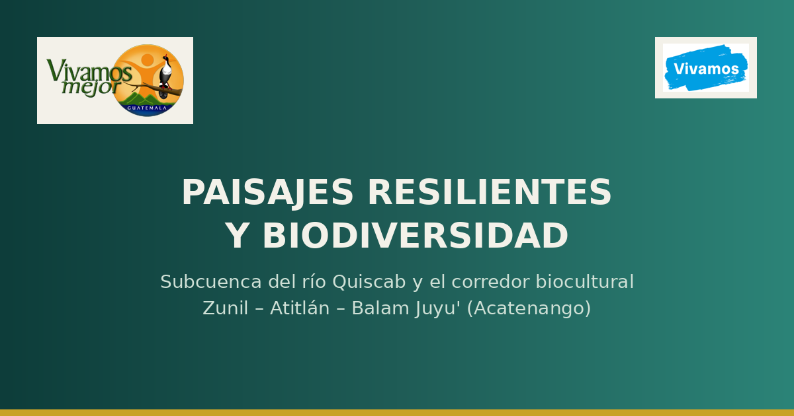

<p align="center">
  
</p>

# Paisajes Resilientes y Biodiversidad

Mapa interactivo de la **subcuenca del río Quiscab** y el **corredor biocultural Zunil – Atitlán – Balam Juyu' (Acatenango)**, Guatemala. Reúne información participativa de agroecología, gestión de ecosistemas, economía rural, e investigación y organización comunitaria, sobre una cartografía base del territorio.

🔗 **[Ver el mapa en vivo](https://TU-USUARIO.github.io/TU-REPO/)** ← actualiza este link cuando publiques en GitHub Pages

> Proyecto de **Vivamos Mejor Guatemala**, construido sobre datos de levantamientos comunitarios (ODK/Kobo), cartografía institucional y estudios técnicos (isótopos, cobertura forestal) de la cuenca de Atitlán.

---

## 📌 Qué muestra el mapa

El mapa se organiza en 5 pestañas:

| Pestaña | Contenido |
|---|---|
| **Panorama General** | Unión de toda la información: cartografía base + las 4 líneas temáticas |
| **Agroecología** | Agricultores agroecológicos, escuelas de campo, sistemas de captación de agua de lluvia |
| **Gestión de Ecosistemas** | Áreas de conservación, brigadas comunitarias, brechas cortafuegos, diagnóstico de estufas ahorradoras de leña, monitoreo de reforestación |
| **Economía Rural** | Diagnósticos de fungicultura y apicultura, diplomado ambiental, escuelas Detectives de la Naturaleza, escuelas CEIBIS de educación ambiental |
| **Investigación y Organización Comunitaria** | Grupos y organizaciones de base, estudio de isótopos para datar el agua en Atitlán (Fase I 2022 / Fase II 2024–2025) |

Como capas de referencia (disponibles en cualquier pestaña): **Municipios**, **Departamentos**, **Corredor biocultural**, **Área de amortiguamiento** y **Cobertura forestal**.

---

## 🗂️ Estructura del proyecto

```
├── index.html                  → estructura de la página
├── css/
│   └── style.css               → todos los estilos
├── js/
│   └── app.js                  → lógica del mapa (capas, pestañas, popups)
├── data/                       → una capa = un archivo GeoJSON (WGS84)
│   ├── municipios.geojson
│   ├── corredor_biocultural.geojson
│   ├── cobertura_forestal.geojson
│   ├── agro_agricultores.geojson
│   ├── isotopos_fase1.geojson
│   └── ...
└── assets/img/                 → logos, íconos personalizados, imágenes
    ├── logo_vivamos_mejor.png
    ├── badge_brigada.png
    └── ...
```

Cada capa temática es un archivo `.geojson` independiente en `/data`. Esto permite:
- Editar o corregir una capa sin tocar el código
- Ver en el historial de Git exactamente qué cambió en los datos
- Cargar el mapa más rápido (el navegador cachea cada archivo por separado)

---

## 🚀 Cómo verlo

### Opción 1 — GitHub Pages (recomendado)
1. Settings → Pages → Branch: `main` → carpeta `/ (root)`
2. Espera 1-2 minutos y tu mapa estará en `https://tu-usuario.github.io/tu-repo/`

### Opción 2 — Local
Como el mapa carga los `.geojson` con `fetch()`, necesitas un servidor local (abrir el `index.html` con doble clic dará error de CORS):

```bash
# Con Python (ya viene instalado en la mayoría de sistemas)
python3 -m http.server 8000
# luego abre http://localhost:8000
```

o con la extensión **Live Server** de VS Code.

---

## 🔧 Cómo agregar o editar una capa

1. Prepara tu archivo en **GeoJSON, proyección WGS84 (EPSG:4326)** — si tu fuente está en otra proyección (GTM, UTM), reprojecta antes con QGIS o `pyproj`.
2. Guárdalo en `/data` con un nombre corto en minúsculas, sin espacios ni tildes (ej. `nueva_capa.geojson`).
3. En `js/app.js`, agrega una entrada al arreglo `LAYER_DEFS`:

```js
{
  id:'nueva_capa', group:'economia', label:'Nombre visible en el panel', type:'point',
  color:'#2e7d9a', icon:'📍', defaultOn:true, file:'data/nueva_capa.geojson',
  popup:f=>popupBlock(f.properties.Nombre, [
    ['Campo a mostrar', f.properties.Campo],
  ])
}
```

- `group` debe ser uno de: `base`, `agroecologia`, `ecosistemas`, `economia`, `comunitaria`
- `type` es `point`, `polygon` o `line`
- Para íconos con imagen propia (en vez de emoji), usa `image:'nombre_en_ASSET_PATHS'` y agrega la ruta en el objeto `ASSET_PATHS` al inicio de `app.js`

No hace falta tocar `index.html` ni `style.css` para una capa nueva estándar.

---

## 🛠️ Tecnologías

- [Leaflet](https://leafletjs.com/) — motor del mapa
- [Leaflet.markercluster](https://github.com/Leaflet/Leaflet.markercluster) — agrupamiento de puntos densos
- Sin frameworks ni build step — HTML/CSS/JS planos, fácil de mantener
- Basemaps: [CARTO Voyager](https://carto.com/basemaps), [Esri World Imagery](https://www.arcgis.com/home/item.html?id=10df2279f9684e4a9f6a7f08febac2a9), [OpenTopoMap](https://opentopomap.org/)

---

## 📊 Fuente y metodología de los datos

- **Encuestas de campo**: formularios ODK/Kobo (agroecología, estufas, reforestación, fungicultura, apicultura), 2025–2027
- **Isótopos para datar el agua en Atitlán**: Fase I (2022, 45 muestras, 1,000–2,465 msnm) y Fase II (2024–2025, 89 muestras, hasta 2,975 msnm)
- **Cobertura forestal**: clasificación satelital, vectorizada y suavizada para visualización web
- **Cartografía base**: municipios, departamentos y corredor biocultural en proyección GTM, reproyectados a WGS84

Todas las coordenadas de los formularios de campo fueron capturadas en campo con GPS (precisión reportada en cada dataset original).

---

## 📄 Licencia

Código bajo licencia [MIT](LICENSE). El uso o redistribución de los datos en `/data` (levantamientos comunitarios) debe acordarse con **Vivamos Mejor Guatemala**.

---

## 🙌 Créditos

Proyecto de **[Vivamos Mejor Guatemala](https://vivamosmejor.org.gt/)**, con la participación de comunidades, brigadas, escuelas y municipalidades de la cuenca del lago de Atitlán y el corredor biocultural Zunil–Atitlán–Balam Juyu' (Acatenango).
